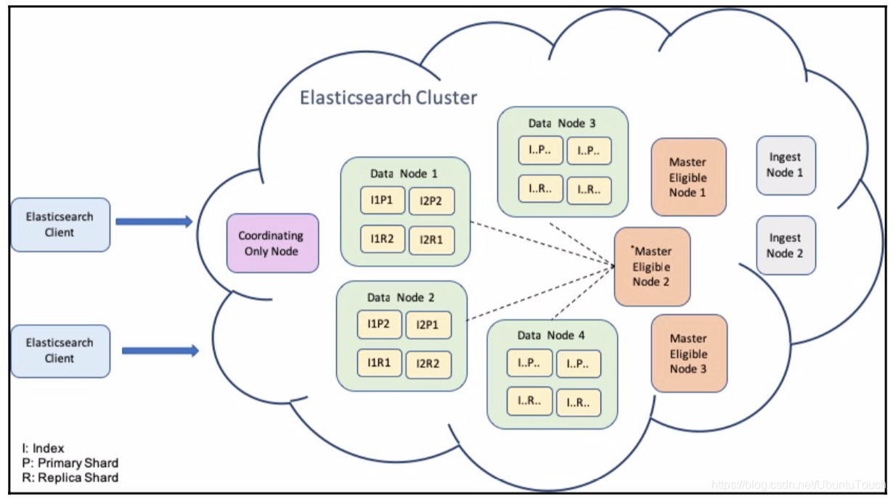

# cluster(集群) node(结点) index(索引) document(文档) shards(分片) replica()

## cluster(集群)
```text
    一个启动的ElasticSearch服务也称为集群，其中可以包含一个或多个结点。它默认为一个叫做“ElasticSearch”的集群，我们可以在config/elasticsarch.yml的
配置文件中自定义其名字。
    自定义集群名字：cluster.name: my-application
```
### es的布局图片

### 获取cluster的状态信息
```text
    cluster的状态只能够被master node结点改变。
    GET _cluster/state
    
    结果：
    {
      "cluster_name": "elasticsearch",
      "compressed_size_in_bytes": 1920,
      "version": 10,
      "state_uuid": "rPiUZXbURICvkPl8GxQXUA",
      "master_node": "O4cNlHDuTyWdDhq7vhJE7g",
      "blocks": {},
      "nodes": {...},
      "metadata": {...},
      "routing_table": {...},
      "routing_nodes": {...},
      "snapshots": {...},
      "restore": {...},
      "snapshot_deletions": {...}
    }
```
## node(结点)
```text
    一个集群由一个node或多个node组成。实际部署中，大多数情况还是一个server运行一个node。

根据node的不同可以分成以下几种：
    master-eligible: 可以作为主node，可以管理整个cluster的设置和变化。例如创建、更新、删除index；添加或删除node；为node分配shard。
    data: 数据node。
    ingest: 数据接入。
    machine learning: 机器学习。

elasticsearch.yml中设置：
    node.master: true # master-eligible
    node.data: true # data
    node.ingest: true # ingest
    node.ml: true  # machine learning
    
    cluster.remote.connect: false # 节点不接收外部的连接
    
    # 设置一个node只作为参与选举表决节点，并且不会当选为master node。这样可以防止脑裂的情况发生。通常由一个cpu性能比较低的node担当。
    node.voting_only: true 
    node.master: true # 表决节点，这个也是要设置的。
```
### 获取所有能够表决的节点
```text
    GET /_cluster/state?filter_path=metadata.cluster_coordination.last_committed_config
    
    结果: 
    {
        "metadata": {
            "cluster_coordination": {
                "last_committed_config": [
                    "81gYn32kQI6K2H9g9IgdjA",
                    "DgJTPorNRC-1EM2_ozmzQA",
                    "aFQ6EuiPTdq5DxbrdX4PbQ"
                ]
            }
        }
    }

    coordination: 协调
```
## Document(文档)
```text
    es的搜索是面向文档的，搜索与操作的最小单位就是文档。类似于表中的字段，但是他是文档类型，类型单一。
    1.它是独立的，文档包含其字段名称和值。
    2.它也可以是分层的，可以视为文档中的文档。具有层级结构。

    文档的数据格式就是json形式。
        
    例：
    {
        "account_number": 1,
        "balance": 39225,
        "name":{
            "firstname": "Amber",
            "lastname": "Duke"
        }
        "age": 32,
        "gender": "M",
        "address": "880 Holmes Lane",
        "employer": "Pyrami",
        "email": "amberduke@pyrami.com",
        "city": "Brogan",
        "state": "IL"
    }
```
## type(类型)
```text
    类型是文档的逻辑容器，类似于表的行容器。每个document都由很多个字段构成，我们可以设置映射每一个字段的类型。
```
## 