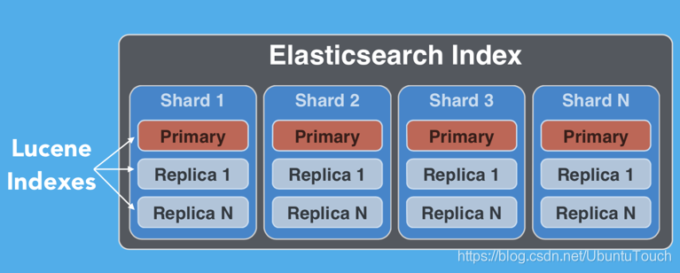
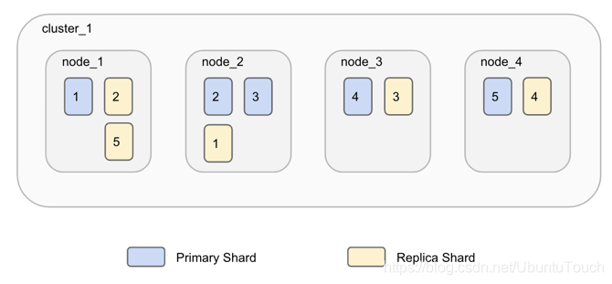
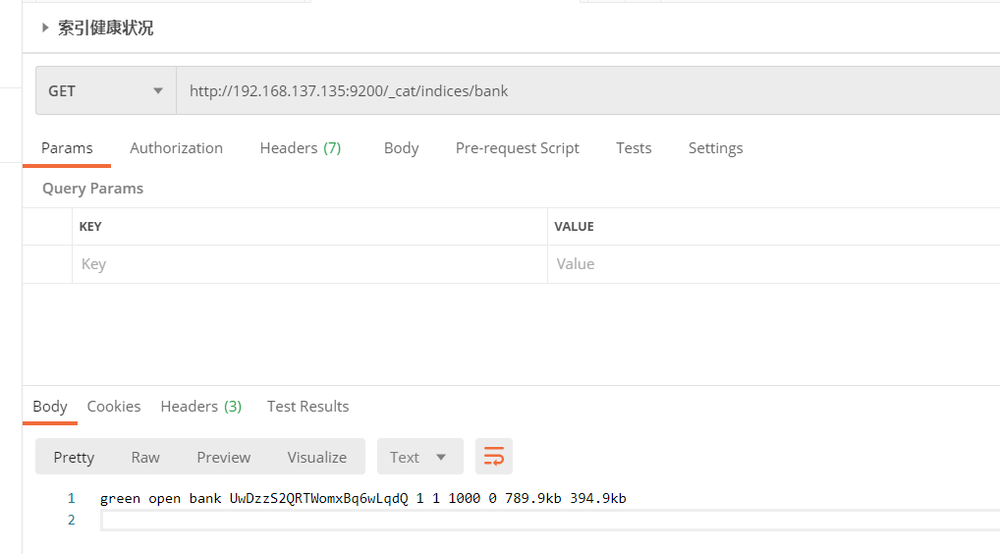

# cluster(集群) node(结点) index(索引) document(文档) shards(分片) replica(副分片)

## cluster(集群)
```text
    一个启动的ElasticSearch服务也称为集群，其中可以包含一个或多个结点。它默认为一个叫做“ElasticSearch”的集群，我们可以在config/elasticsarch.yml的
配置文件中自定义其名字。
    自定义集群名字：cluster.name: my-application
```
### es的布局图片

### 获取cluster的状态信息
```text
    cluster的状态只能够被master node结点改变。
    GET _cluster/state
    
    结果：
    {
      "cluster_name": "elasticsearch",
      "compressed_size_in_bytes": 1920,
      "version": 10,
      "state_uuid": "rPiUZXbURICvkPl8GxQXUA",
      "master_node": "O4cNlHDuTyWdDhq7vhJE7g",
      "blocks": {},
      "nodes": {...},
      "metadata": {...},
      "routing_table": {...},
      "routing_nodes": {...},
      "snapshots": {...},
      "restore": {...},
      "snapshot_deletions": {...}
    }
```
## node(结点)
```text
    一个集群由一个node或多个node组成。实际部署中，大多数情况还是一个server运行一个node。

根据node的不同可以分成以下几种：
    master-eligible: 可以作为主node，可以管理整个cluster的设置和变化。例如创建、更新、删除index；添加或删除node；为node分配shard。
    data: 数据node。
    ingest: 数据接入。
    machine learning: 机器学习。

elasticsearch.yml中设置：
    node.master: true # master-eligible
    node.data: true # data
    node.ingest: true # ingest
    node.ml: true  # machine learning
    
    cluster.remote.connect: false # 节点不接收外部的连接
    
    # 设置一个node只作为参与选举表决节点，并且不会当选为master node。这样可以防止脑裂的情况发生。通常由一个cpu性能比较低的node担当。
    node.voting_only: true 
    node.master: true # 表决节点，这个也是要设置的。
```
### 获取所有能够表决的节点
```text
    GET /_cluster/state?filter_path=metadata.cluster_coordination.last_committed_config
    
    结果: 
    {
        "metadata": {
            "cluster_coordination": {
                "last_committed_config": [
                    "81gYn32kQI6K2H9g9IgdjA",
                    "DgJTPorNRC-1EM2_ozmzQA",
                    "aFQ6EuiPTdq5DxbrdX4PbQ"
                ]
            }
        }
    }

    coordination: 协调
```
## Document(文档)
```text
    es的搜索是面向文档的，搜索与操作的最小单位就是文档。类似于表中的字段，但是他是文档类型，类型单一。
    1.它是独立的，文档包含其字段名称和值。
    2.它也可以是分层的，可以视为文档中的文档。具有层级结构。

    文档的数据格式就是json形式。
        
    例：
    {
        "account_number": 1,
        "balance": 39225,
        "name":{
            "firstname": "Amber",
            "lastname": "Duke"
        }
        "age": 32,
        "gender": "M",
        "address": "880 Holmes Lane",
        "employer": "Pyrami",
        "email": "amberduke@pyrami.com",
        "city": "Brogan",
        "state": "IL"
    }
```
## type(类型)(在8.0将会被删除)
```text
    类型是文档的逻辑容器，类似于表(table)。我们不需要像数据库一样事先定义好表的字段和类型，es会根据我们添加到index的进json进行mapping映射
类型，当然我们也可以禁止这种行为。其中时间、字符串和地理位置(geo_point)等我们需要手动映射。

    注意：在es6.0以后的版本，一个index只能包含一个type。这其中的原因是：相同的index的不同映射type中具有相同名称的字段是相同的；在es的索引
中，不同映射type中具有相同名称的字段在lucene中被同一个字段支持。在默认情况下是_doc。在未来的8.0版本中，type将会被彻底删除。
```
## index(索引)

```text
    索引是文档的集合。每一个索引都是由一个或者多个文档(document)组成，并且这些document可以分布在不同的shard之中。index类似于数据库中
的database，但是不能完全将它视为database这个概念，原因是es文档中拥有object及nested结构。
    一个index是一个逻辑命名空间，它可以映射到一个或者多个主分片，并且可以拥有零个和多个副分片。它会将文档平衡得存放到share中。
        计算公式： shard_num = hash(_routing) % num_primary_shards
    从上面的公式我们也可以看出来，我们的 shard 数目是不可以动态修改的，否则之后也找不到相应的 shard 号码了。必须指出的是，replica 的数
目是可以动态修改的。
```
## share(分片)
```text
    由于 Elasticsearch 是一个分布式搜索引擎，因此索引通常会拆分为分布在多个节点上的称为分片的元素。Elasticsearch 自动管理这些分片的排列。 
 单个节点处理搜索请求，响应太慢，为了解决这个问题，Elasticsearch 提供了将索引划分成多份的能力，这些份就叫做分片（shard）。
    你可以指定你想要的分片(shard)的数量。每个分片本身也是一个功能完善并且独立的“索引”，这个“索引”可以被放置到集群中的任何节点上。 分片之所以
重要，主要有两方面的原因：
    ①允许你水平分割/扩展你的内容容量
    ②允许你在分片（潜在地，位于多个节点上）之上进行分布式的、并行的操作，进而提高性能/吞吐量

    有两种类型的分片：primary shard 和r eplica shard。
        Primary shard: 每个文档都存储在一个Primary shard。
        Replica shard: 每个主分片可以具有零个或多个副本。
    默认情况下，每个主分片都有一个副本，但可以在现有索引上动态更改副本数。 永远不会在与其主分片相同的节点上启动副本分片。

    下图有五个share和他们各自的一个relica：
```

## replica(副本分片)
```text
    默认情况下，Elasticsearch 为每个索引创建一个主分片和一个副本。这意味着每个索引将包含一个主分片，每个分片将具有一个副本。
    主分片可以接受索引请求。副本和主分片都可以提供查询请求。
    number_of_shards 值与索引有关，而不是与整个群集有关。此值指定每个索引的分片数（不是群集中的主分片总数）。
    
通过如下的接口来获得一个 index 的健康情况：
    http://192.168.137.135:9200/_cat/indices/bank
```

```text
    shard 健康
    
    红色：集群中未分配至少一个主分片。
    黄色：已分配所有主副本，但未分配至少一个副本，并且在其他node中没有其副本，或者副本都是在主node里边。
    绿色：分配所有分片。
```

```text
参考资料：https://blog.csdn.net/UbuntuTouch/article/details/99443042
```